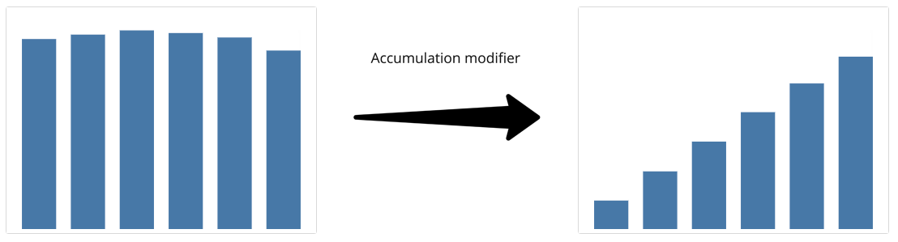
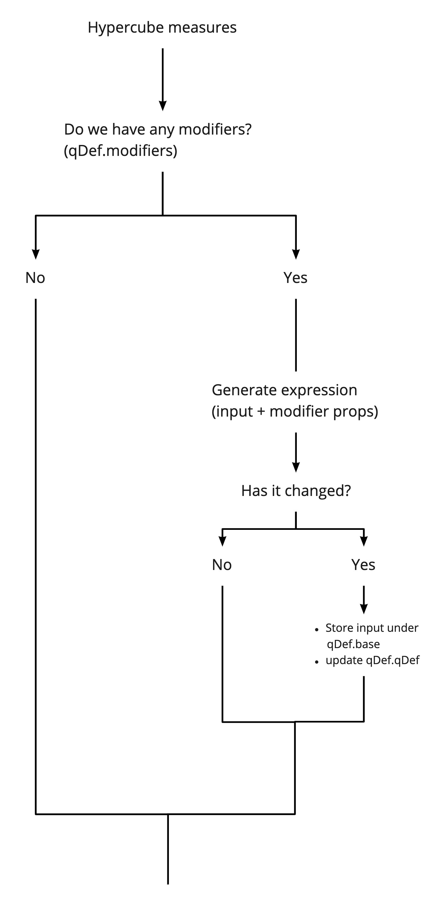
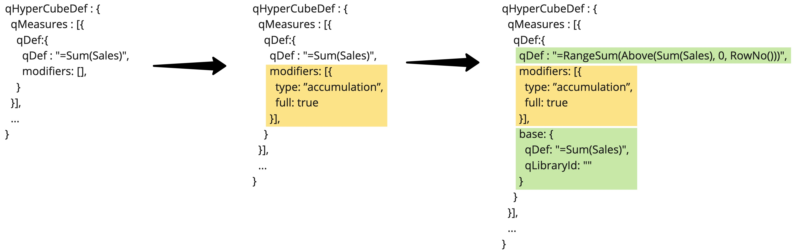

# qlik-modifiers
A JavaScript module for handling expression modifiers in Qlik products.
### !EXPERIMENTAL!

The idea is to provide a set of useful expression modifiers and a convenient way to work with those.  
First in place is `accumulation` which can produce results similar to this:

  

### How does it work?

A modifier transforms a hypercube measure expression in a certain way to achieve desired results.
Below is a high-level overview of how the concept works.

  

  

### Api
[See Api documentation](docs/api.md)

### Release branches

| Modifiers                      | Branch                                                                         |
| ------------------------------ | ------------------------------------------------------------------------------ |
| Add Relative                   | [release/0.4.x](https://github.com/qlik-oss/qlik-modifiers/tree/release/0.4.x) |
| Add Moving average, Difference | [release/0.3.x](https://github.com/qlik-oss/qlik-modifiers/tree/release/0.3.x) |
| Add Accumulation               | [release/0.2.x](https://github.com/qlik-oss/qlik-modifiers/tree/release/0.2.x) |

### Releasing

Simply run the [create-release](https://github.com/qlik-oss/qlik-modifiers/actions/workflows/create-release.yaml) workflow.

It requires a branch to deploy as a parameter, this should _always_ be `master`.

You need to be a collaborator to run this workflow.